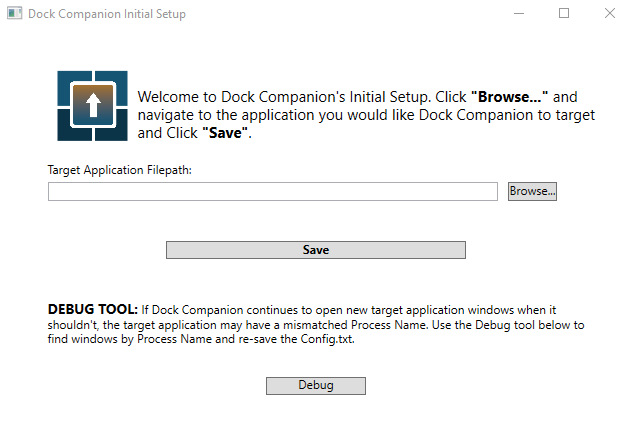
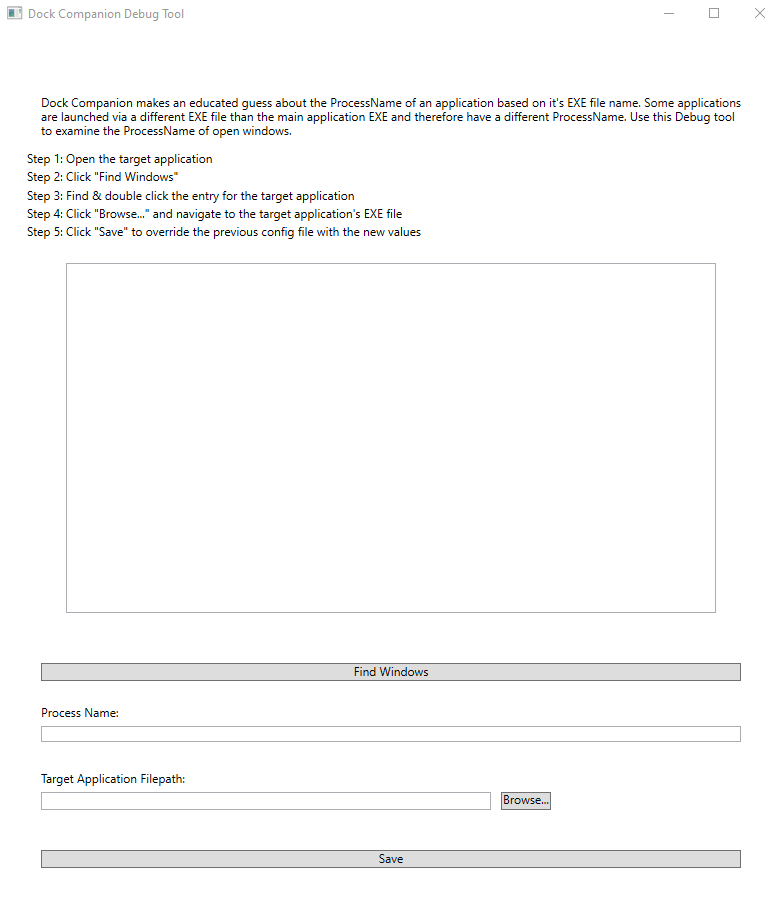

# Dock-Companion-Setup
</img>

<h2 id="about">About</h2>
Dock Companion Config Setup & Debugger is a C# WPF application that assists the user in creating a Config.txt file on the initial setup of <a href="https://github.com/tronfacex/Dock-Companion">Dock Companion</a>.
  
It also contains a debugging tool that pulls the handle, window title and process name of each open application window and allows users to override the default Process Name in the Config.txt file.  
This repo does not contain a release, but you can find the latest release packaged with the latest release of <a href="https://github.com/tronfacex/Dock-Companion">Dock Companion</a>.  

This project is published with a GNU General Public License v3.0.

Attributions are located [here](ATTRIBUTIONS.md).

<h2 id="intial-setup-window">Initial Setup Window:</h2>

<h2 id="debug-window">Debug Tool Window</h2>

